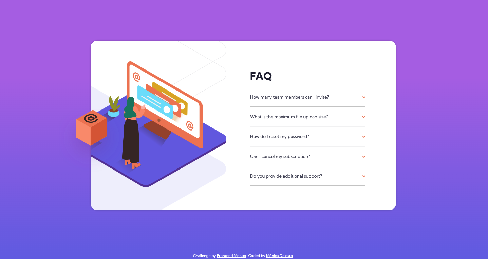
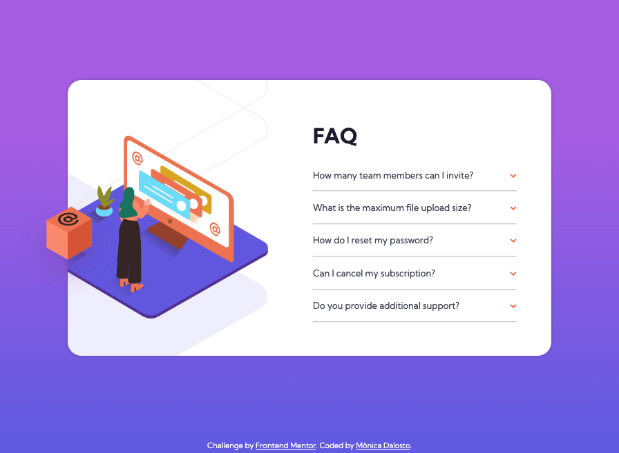

# frontend-mentor-challenge08-faq-accordion-card-component
 Projects built from frontendmentor.io

# Frontend Mentor - FAQ accordion card solution

This is a solution to the Eighth challenge from Frontend Mentor. Frontend Mentor challenges help you improve your coding skills by building realistic projects.
The challenge: [FAQ accordion card challenge on Frontend Mentor](https://www.frontendmentor.io/challenges/faq-accordion-card-XlyjD0Oam). 

## Table of contents

- [Overview](#overview)
  - [The challenge](#the-challenge)
  - [Screenshot](#screenshot)
  - [Links](#links)
- [My process](#my-process)
  - [Built with](#built-with)
  - [What I learned](#what-i-learned)
  - [Continued development](#continued-development)
- [Author](#author)

## Overview

### The challenge

Users should be able to:

- View the optimal layout for the component depending on their device's screen size (375px | 900px | 1440px)
- See hover states for all interactive elements on the page
- Hide/Show the answer to a question when the question is clicked

### Screenshot

- Desktop Screen (1440x768):  

- Desktop Screen (990x660):  

- Desktop Screen Active State:  

- Desktop Screen Hover State:  

- Mobile Screen (375x768)  

- Mobile Screen Active State  

### Links

- Solution URL: [FAQ accordion card challenge](https://github.com/MonicaDalosto/frontend-mentor-challenge08-faq-accordion-card-component)
- Live Site URL: [Add live site URL here](https://monicadalosto.github.io/frontend-mentor-challenge08-faq-accordion-card-component/)

## My process

### Built with

- Semantic HTML5 markup
- CSS custom properties
- Flexbox
- Mobile-first workflow
- VanillaJS code;

### What I learned

- I've practiced how to code using the mobile first concept
- How to use the background-position to position the images on the background
- I've tried to use more specific classes for the stylisting
- How to use forEach for method to iterate over the classes elements

### Continued development

- Practice more the flexbox tools
- Practice more the background position
- Practice more the JS fundamentals

## Author

- Frontend Mentor - [@MonicaDalosto](https://www.frontendmentor.io/profile/MonicaDalosto)
- Github - [@MonicaDalosto](https://github.com/MonicaDalosto)
